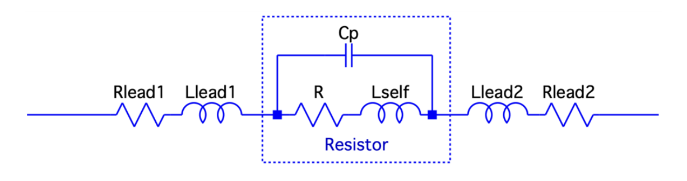
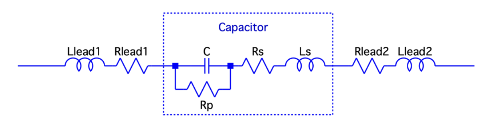
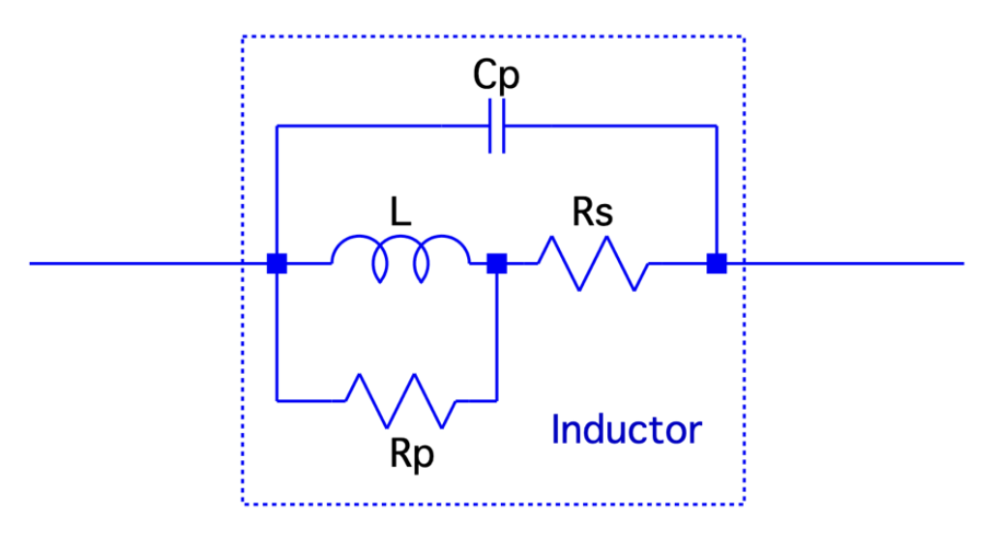

<h1 align="center">
	Lab 1: The Secret Life of Passive Components
	 
	and
	 
	We meet a new friend, the VNA
</h1>

## Table of Contents
- [Authors](#authors)
- [Abstract](#abstract)
- [Introduction](#introduction)
- [Experimentsl Setup](#experimental-setup)
- [Measurements and Results](#measurements-and-results)
- [Discussion](#discussion)
- [Summary](#summary)

## Authors

Author: Benjamin Sage

Lab Partners: Marc Huerta and Devorah Simon

## Abstract

Passive components in electronics are devices which only receive energy to be manipulated, but need no power to operate. Three of these components - resistors, capacitors, and inductors - form the basis of circuit design and analysis. In this lab, we analyze these three components using a Vector Network Analyzer (VNA) to see where they deviate from their theoretical behavior in real life. This analysis gives rise to an important discovery known as self-resonant frequency.

## Introduction

There are three principle passive components in electronic circuit analysis:
- Resistor
- Capacitor
- Inductor

Their impedance formulas follow, with R standing for Resistor, C for Capacitor, and L for Inductor:

These are, however, theoretical only. Every resistor, capacitor, and inductor, in real life, actually contains all three of these components. A real resistor actually has a theoretical resistor, capacitor, and inductor, as do real capacitors and inductors.

The additional theoretical components are known as **pararasitics**.

### Parasitics

**Figure 1: Model of a real resistor**

**Figure 2: Model of a real capacitor**

**Figure 3: Model of a real inductor**

## Experimental Setup

## Measurements and Results

## Discussion

## Summary
